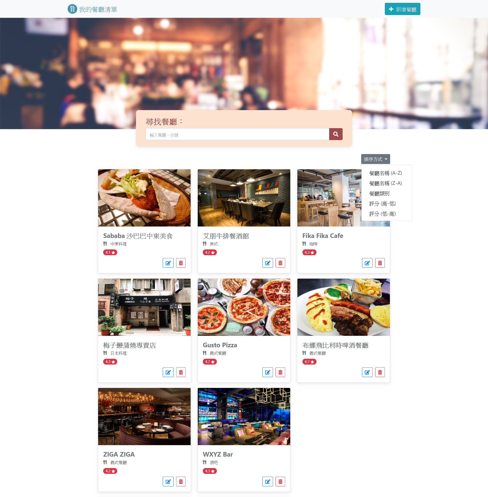

# 我的餐廳清單

用 Node.js 搭配 Express 框架建立的簡易網頁，連結 MongoDB 並加上 CRUD 的功能

## 畫面




## Features

1.使用者可以新增一家餐廳
2.使用者可以瀏覽一家餐廳的詳細資訊
3.使用者可以瀏覽全部所有餐廳
4.使用者可以修改一家餐廳的資訊
5.使用者可以刪除一家餐廳

## 環境建置與需求

node.js v10.15.0 -執行環境 express v4.14.7 -框架 express-handlebars v4.0.4 -模板引擎 

## 安裝與使用

下載專案

```bash
git clone https://github.com/Mia-Chen-taiwan/restaurant_list_CRUD.git
```

安裝package

```bash
npm install
```

使用nodemon啟動伺服器

```bash
npm run dev
```

或正常啟動

```bash
npm start
```